# Storage Gateway - File Gateway

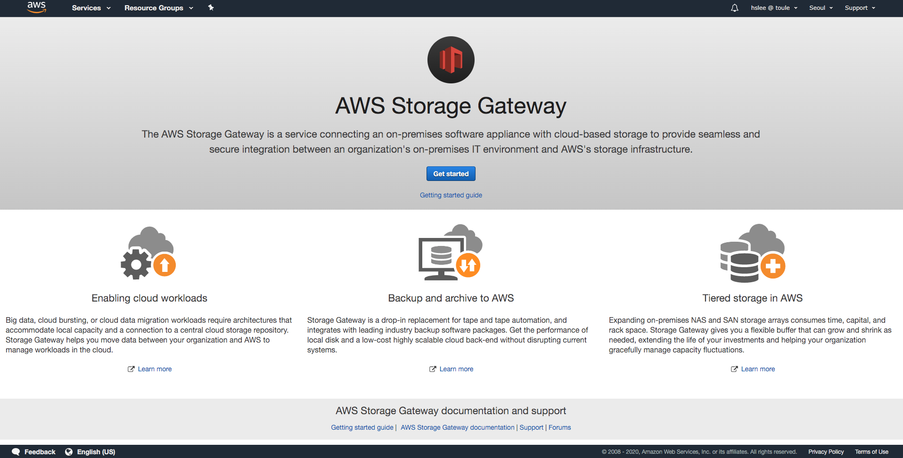

## NFS

### Select Gateway

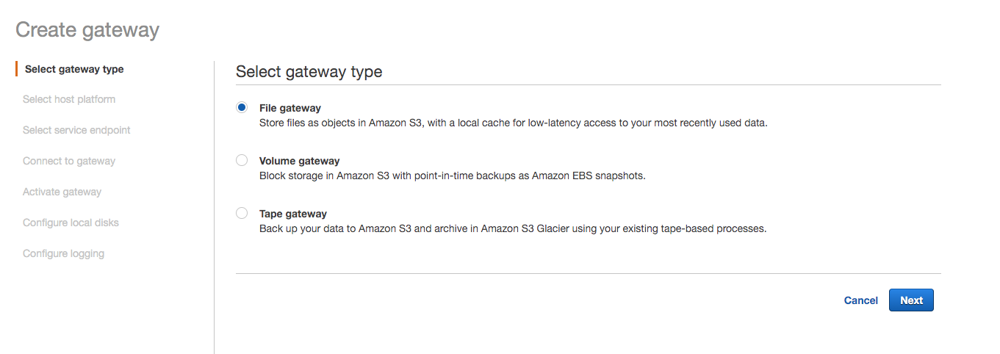


### Select Host platform

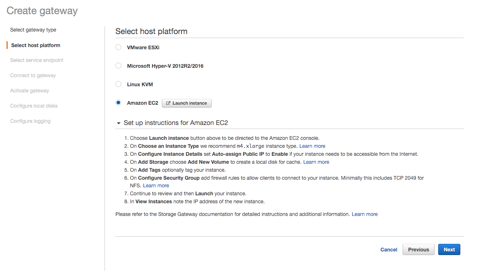

- 주의점

  - 인스턴스는 xlarge 이상으로 하는 것을 권장함 (vCPUs 4이상, Memory 16Gib이상, 캐시용 EBS는 150이상)

  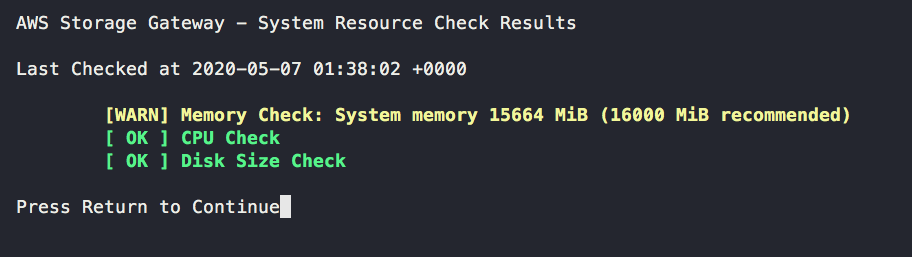

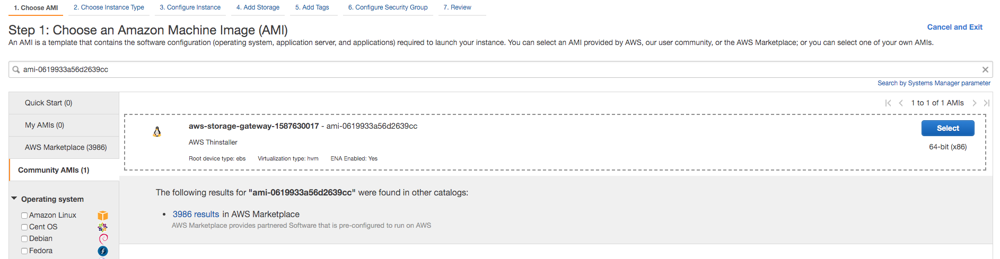

- 기생성된 Storage Gateway Image를 사용하며 m5a.xlarge를 사용
- 인스턴스는 public subnet에 구성
- Tag는 Name:NFS-Storage-Gateway로 생성
- Elastic IP를 만들어서 Attach하는 것을 권장함
- 나머지는 Default

### Select Storage

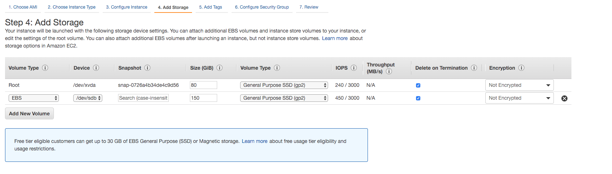

### Security Group

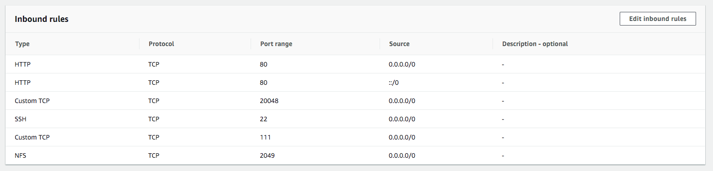

- 테스트용으로 모두 Any로 구성

- 참고: 포트 요구사항 (https://docs.aws.amazon.com/ko_kr/storagegateway/latest/userguide/Resource_Ports.html)

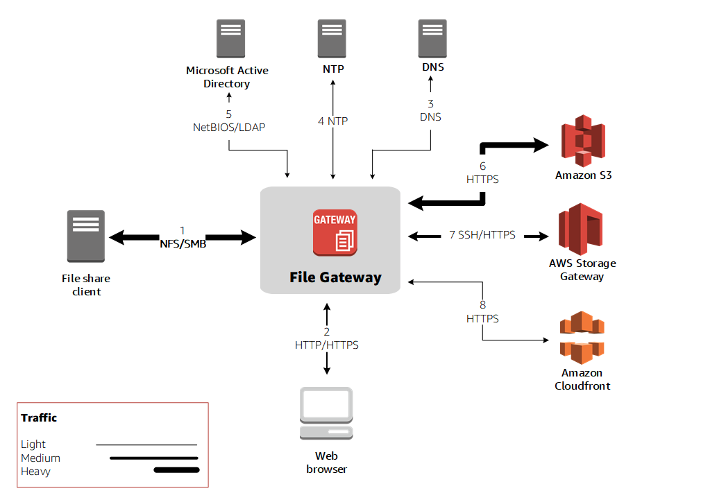

443(HTTPS) : AWS Service Endpoint

80(HTTP) : 정품 인증 전용, Storage Gateway 어플라이언스의 정품 인증 동안에만 사용

53(DNS) : Storage Gateway VM과 DNS 서버 간의 통신

22(TCP) : 지원 채널

123(NTP) : 로컬 시스템이 VM 시간을 호스트 시간과 동기화 하는데 사용

NFS(111, 2049, 20048) : 파일 공유 데이터 전송


### Select Endpoint

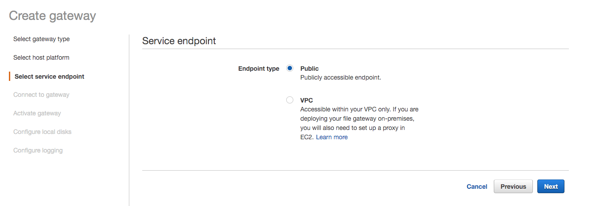

- 테스트용으로 Public하게 구성


### Connect Gateway

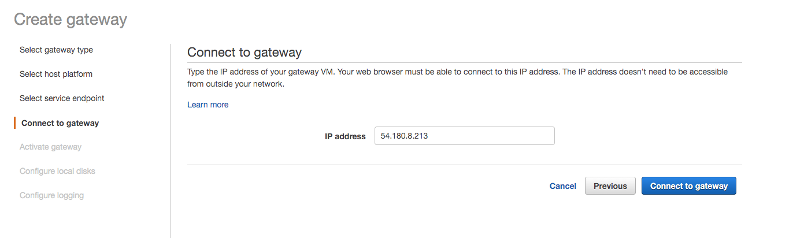

- VM public IP 기입


### Active

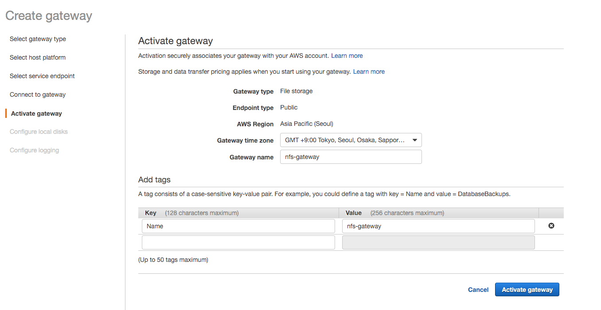


### Configure local disks (Cache Storage)

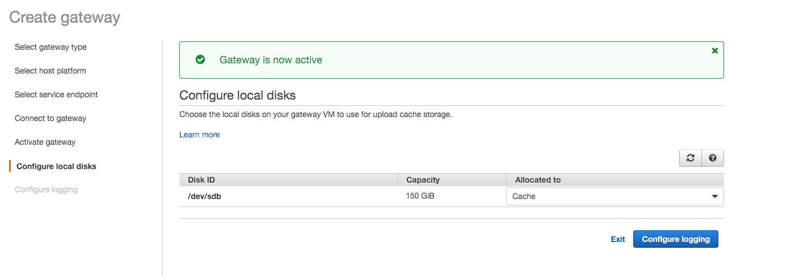


### Log Group

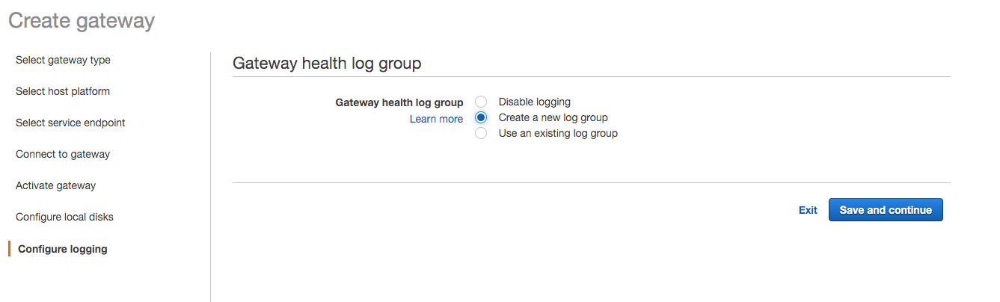

- 로그 그룹 설정


### Confirm Gateway

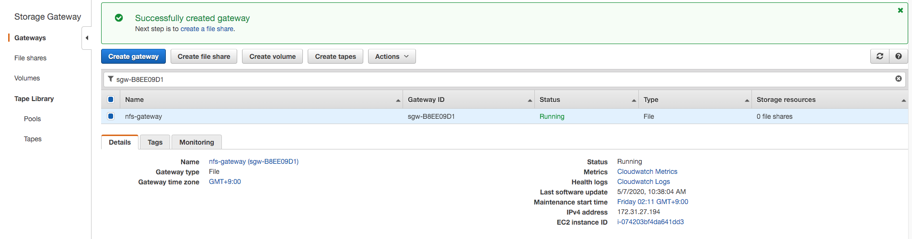


### File share (Connect S3)

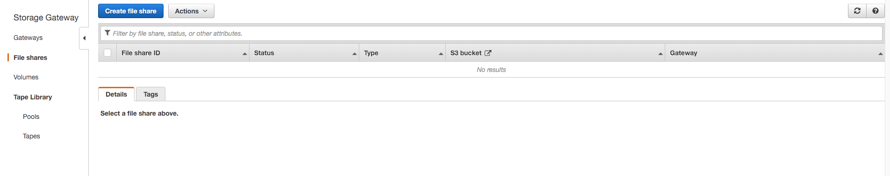

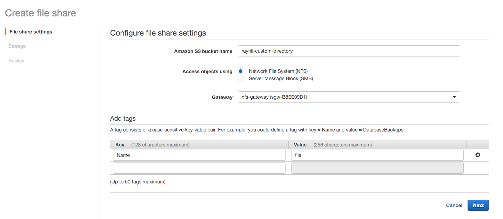

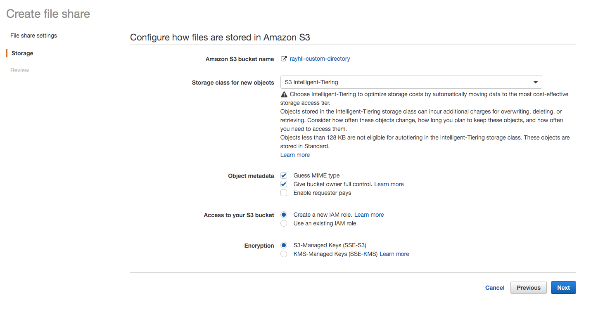

- S3 Intelligent-Tiering : 데이터를 가장 비용 효율적인 스토리지 접근 티어로 자동으로 이동 (128KB 미만의 객체는 제외)

### Confirm File share

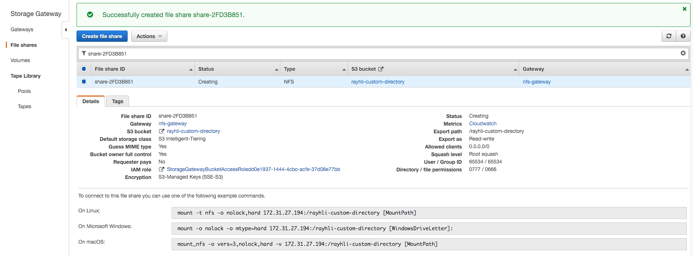


### Test

#### SSH Admin Connection

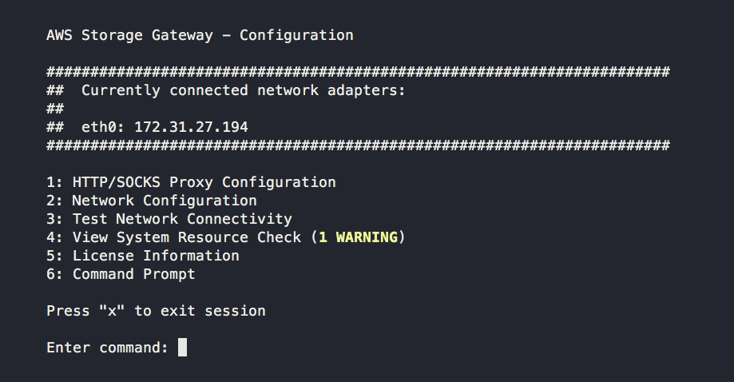

- admin으로 접속할 때 다음과 같이 확인 가능

#### Windows

```bash
mount -o nolock -o mtype=hard <VM-IP>:/<S3-Bucket-PATH> [WindowsDriveLetter]:
```

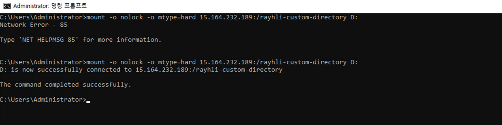

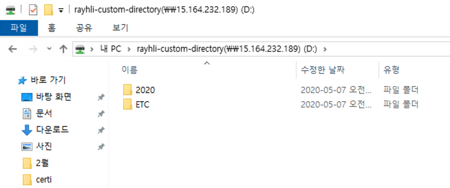

- Windows에서 동작을 확인하기 위해서는 NFS 설정을 활성화 해야함


#### Linux

```bash
mount -t nfs -o nolock,hard <VM-IP>:/<S3-Bucket-PATH> [MountPath]
```

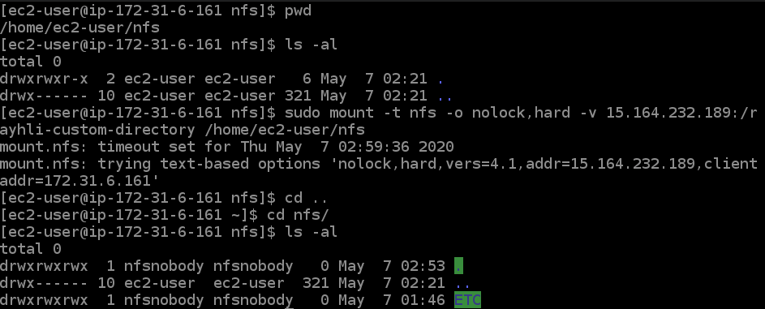

#### Monitoring

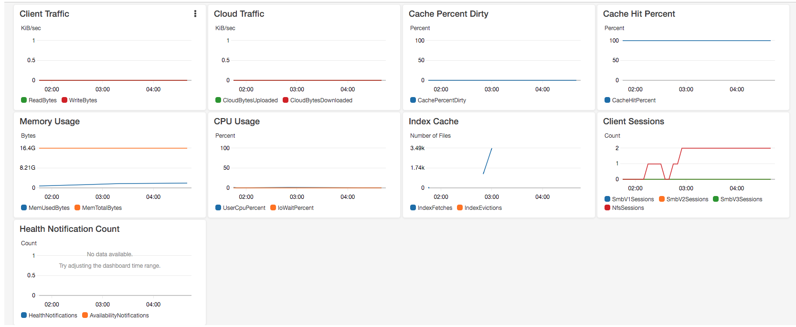


## 인프라 삭제

1. File Share 설정 삭제
2. Gateway 삭제
3. VM 삭제
4. Security Group 삭제

추가: 기존에 Elastic IP를 만들었다면 Release 해야함